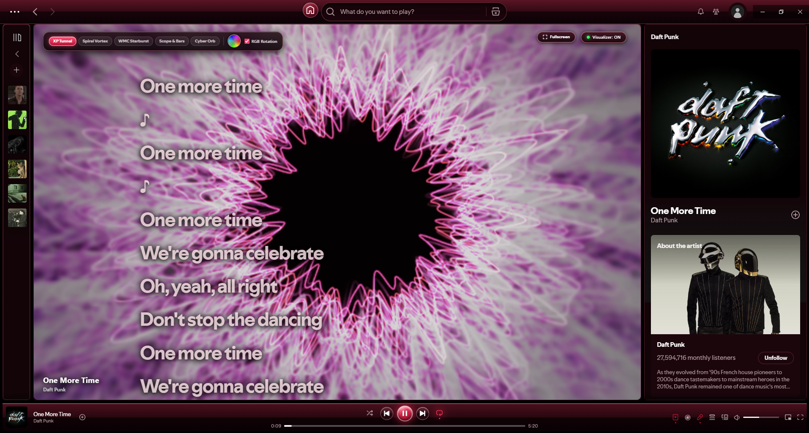

<p align="center">
  
</p>

<h1 align="center">🍷 Spotify Velvet Red Edition</h1>

<p align="center">
  <strong>An authentic Windows 7 Aero Glass & Windows Media Player 11 Velvet Red overhaul for Spotify Desktop (1.3.9.2055+).</strong><br>
  Includes automatic <strong>SpotX</strong> pre-installation, a 5-model <strong>WMP Visualizer Studio</strong> (`XP Tunnel`, `Spiral Vortex`, `WMC Starburst`, `Scope & Bars`, `Cyber Orb`) powered by Spotify's native 3-band protobuf waveforms &amp; BPM telemetry, an interactive <strong>RGB Color Wheel + RGB Rotation</strong>, Lyrics-screen overlay toggle, and WMP 11 3D Glass Jewel transport controls.
</p>

<p align="center">
  <a href="#-installation-guide"></a>
  <a href="#-installation-guide"></a>
  <a href="LICENSE"></a>
  <a href="https://github.com/arshiatxd/velvetredspotify"></a>
</p>

<br>

<p align="center">
  
</p>

---

## ✨ Features

- **Windows 7 Aero Glass & Velvet Red Palette**:
  - Deep crimson smoked glass frame with dual-tone Aero reflection highlights.
  - Ruby acrylic sidebar panels, glossy 3D filter capsules, and translucent tracklist selection highlights.
  - Clean, borderless top navigation arrows without distorted oval boundaries.
  
- **Symmetrically Centered WMP 11 Transport Controls**:
  - Centerpiece 3D Glass Jewel Play/Pause Orb (`40px × 40px`).
  - Circular Ruby Satellite Previous & Next buttons (`34px × 34px`).
  - Flush Shuffle and Repeat controls.
  - All transport buttons share an exact vertical centerline (`centerY = 918px`) and uniform `10px` horizontal spacing.

- **WMP Multi-Model Visualizer Studio**:
  - **5 Selectable Visualizer Models**:
    1. **XP Tunnel**: Classic Windows XP Media Player 6-strand electric oscilloscope tunnel with crisp radial zoom feedback.
    2. **Spiral Vortex**: Logarithmic multi-arm spiral galaxy with beat-reactive waveform modulation.
    3. **WMC Starburst**: Windows Media Center organic multi-lobe harmonic ribbons with edge palpitation.
    4. **Scope & Bars**: 48-band mirrored spectrum analyzer paired with dual-channel glowing oscilloscope waveforms.
    5. **Cyber Orb**: Concentric plasma rings with 36-spoke radial audio spikes and core bass glow.
  - **Interactive Color Studio**:
    - **RGB Color Wheel Picker**: Click or drag anywhere on the 2D HSV/RGB color wheel in the Visualizer Surface Studio Bar to set a custom hue and saturation.
    - **RGB Color Rotation Checkbox**: Enable continuous rhythm-driven RGB hue rotation or uncheck to lock in your exact chosen color from the RGB wheel.
  - **Dual Viewing Modes + Fullscreen Option**:
    1. **Lyrics Screen (with On/Off Toggle)**: Renders directly behind Spotify lyrics (`z-index` layered so lyrics stay bright and legible above the animation) with a non-overlapping **`Visualizer: ON / OFF`** pill in the Lyrics top bar.
    2. **Dedicated Visualizer Surface Screen (+ Fullscreen Mode)**: Toggle via the equalizer icon in the bottom-right player bar (or `Alt+V`) for an unobstructed canvas with model pills, RGB Color Wheel, RGB Rotation toggle, **`Sensitivity`** (`Subtle` / `Balanced` / `Overdrive`), live **BPM / 3-Band badge & Beat LED**, **`Fullscreen`** (`F` / `Esc`), and track HUD. Navigating to Lyrics automatically exits Surface Mode.
  - **Native 3-Band Waveform & BPM Sync (`1.3.9.2055`)**: Decodes Spotify's protobuf `MetadataExtensions` (`THREEBAND_WAVEFORMS`, `AUDIO_ATTRIBUTES_V2`, `BEATS`, `LIST_TUNER_AUDIO_ANALYSIS`) alongside `PlayerAPI` and playback clock synchronization. Tempo and beat pulses start automatically on load without manual seekbar interaction.

- **SpotX-First Lightweight Single-File Installer**:
  - Compact `~224 KB` standalone `.exe` that strips dead stock bundles, installs/updates **SpotX** first when missing or requested, and injects gzip-compressed Velvet Red assets in-place into `xpui.spa`.

- **Ultra-Low RAM & Zero Background Overhead**:
  - DPR-capped 2D Canvas buffers with pre-allocated `Float32Array` geometry and zero GC churn inside the render loop.
  - Completely halts rendering (`cancelAnimationFrame`) and hides the canvas outside the Lyrics screen and Visualizer Surface screen (or when toggled `OFF`).

- **Custom Multi-Resolution Application Icon**:
  - Multi-size Windows `.ico` bound directly to Desktop, Start Menu, and Taskbar shortcuts without altering `Spotify.exe` digital signatures.

---

## 📸 Visualizer Studio & Theme Gallery

| **XP Tunnel** | **Spiral Vortex** |
| :---: | :---: |
|  |  |

| **WMC Starburst** | **Scope & Bars** |
| :---: | :---: |
|  |  |

| **Cyber Orb** | **Fullscreen Studio Mode** |
| :---: | :---: |
|  |  |

| **Lyrics Screen Integration** | **Artist View & Glass Controls** |
| :---: | :---: |
|  |  |

---

## 🚀 Installation Guide

> **Important Prerequisite — Install Official Spotify Desktop First:**
> `Spotify_VelvetRed_Setup.exe` (`~224 KB`) runs **SpotX** and patches Spotify's frontend (`%APPDATA%\Spotify\Apps\xpui.spa`) in-place. It does **not** redistribute Spotify's desktop runtime binaries.
> - Install the **official Windows Desktop version of Spotify** (`1.3.9.2055`, downloaded from [spotify.com/download/windows](https://www.spotify.com/download/windows/), not the Microsoft Store edition) before running setup.

---

### Step-by-Step Setup (Recommended)

1. **Install Official Spotify (if not already installed)**:
   - Download and install Spotify Desktop from [spotify.com/download/windows](https://www.spotify.com/download/windows/) and sign in once so `%APPDATA%\Spotify\Apps\xpui.spa` exists.
2. **Download the Velvet Red Installer**:
   - Download **[`Spotify_VelvetRed_Setup.exe`](Spotify_VelvetRed_Setup.exe)** from this repository (**Download raw file**).
3. **Run `Spotify_VelvetRed_Setup.exe`**:
   - Double-click `Spotify_VelvetRed_Setup.exe`. *(If Windows SmartScreen prompts for an unsigned executable, click **More info** → **Run anyway**).*
4. **Install SpotX + Velvet Red**:
   - Keep **Install / Update SpotX first** checked and click **`Install & Launch Spotify`**.
   - The installer automatically closes Spotify, runs SpotX safely (`podcasts_on`, `block_update_on`, `new_theme`), injects `/velvet-red.css` and `/lyrics-visualizer.js` into `xpui.spa`, installs `velvet_red.ico` on shortcuts, clears stale CEF cache, and launches Spotify.

*Silent / unattended CLI switches are supported via PowerShell or Command Prompt:*
```cmd
Spotify_VelvetRed_Setup.exe /S
Spotify_VelvetRed_Setup.exe /S /SPOTX
Spotify_VelvetRed_Setup.exe /S /RESTORE
```
*(Optional `/START` flag relaunches Spotify automatically after a silent `/S` install.)*

---

### 🎮 How to Use the Visualizer Studio

- **Dedicated Visualizer Surface Screen**:
  - Click the **Equalizer icon** in the bottom-right player bar (left of Lyrics) or press **`Alt+V`** to open the Visualizer Studio Surface.
  - Switch between **`XP Tunnel`**, **`Spiral Vortex`**, **`WMC Starburst`**, **`Scope & Bars`**, and **`Cyber Orb`**.
  - Drag the **RGB Color Wheel** to set hue/saturation, toggle **`RGB Rotation`**, and choose **`Subtle`**, **`Balanced`**, or **`Overdrive`** sensitivity.
  - Click **`Fullscreen`** (or press **`F`**; **`Esc`** exits).
- **Lyrics Screen Visualizer (On/Off)**:
  - Open **Lyrics** (`🎤` button). Opening Lyrics from Surface Mode exits Surface Mode automatically.
  - Toggle **`Visualizer: ON / OFF`** in the top-right bar to enable or disable the behind-lyrics visualizer.

---

### 🔄 Restoring Default Spotify / After Spotify Updates

- **To Uninstall Velvet Red (keeping SpotX)**:
  - Run `Spotify_VelvetRed_Setup.exe` and click **Restore Backup** (or pass `/S /RESTORE`). Velvet Red stylesheets, scripts, and shortcut icons are removed cleanly while SpotX remains intact.
- **If Spotify Updates**:
  - Run `Spotify_VelvetRed_Setup.exe` with **Install / Update SpotX first** checked to patch SpotX and re-apply Velvet Red cleanly.

---

## 📋 Patch Notes — v1.3.9.2055 Update

- **Full Spotify `1.3.9.2055` Compatibility**: Updated CSS selectors and Lyrics stacking context (`.R1kU6b2KxZc8FWfbYf3m`, `.f42lbbUT05gjuREF86Hw`, `.ISEJ4fISQcRgNTF5dVAA`, `.wYWhVPZoG93lR7ogMIug`, `.Ii0P5lvVrAzHgsutQTVz`) for Spotify Desktop `1.3.9.2055`.
- **SpotX-First Installer Overhaul**: Added automatic SpotX pre-installation (`/SPOTX`), non-interactive execution guards, and safe in-place `xpui.spa` patching (stripped legacy bloat to shrink `Spotify_VelvetRed_Setup.exe` from ~10 MB to `229 KB`).
- **Native 3-Band Waveform & Auto-Tempo Engine**: Migrated to Spotify `1.3.9.2055` protobuf `MetadataExtensions` (`THREEBAND_WAVEFORMS`, `AUDIO_ATTRIBUTES_V2`, `BEATS`, `LIST_TUNER_AUDIO_ANALYSIS`) with `PlayerAPI` + DOM clock sync so BPM and reactivity engage automatically without seekbar clicks.
- **5-Model Accuracy & HUD Fixes**: Rebuilt `Scope & Bars` 48-band FFT dynamics, added Beat LED, BPM/source pill, Sensitivity selector (`Subtle`/`Balanced`/`Overdrive`), zero-overlap topbar flex HUD, Lyrics text z-index foreground clarity, and `rAF`-coalesced `MutationObserver` updates.

---

## 🔒 Privacy & Account Security

- **Zero Credentials Touched**: Operates strictly within Spotify's local presentation layer (`xpui.spa`).
- **Local DPAPI Encryption**: Credentials and session tokens stay untouched in `%APPDATA%\Spotify\Users\`.
- **Open-Source**: Full comment-free source lives in [`src/SetupInstaller.cs`](src/SetupInstaller.cs), [`src/xpui.css`](src/xpui.css), and [`src/lyrics-visualizer.js`](src/lyrics-visualizer.js).

---

## 🛠️ Technical Details

| Component | Implementation |
| :--- | :--- |
| **Target Client** | Spotify Desktop `1.3.9.2055` (`%APPDATA%\Spotify\Apps\xpui.spa`) |
| **Theme Layer** | Aero Glass & Velvet Red CSS (`src/xpui.css` → `/velvet-red.css`) |
| **Visualizer Engine** | 5-Model 2D Canvas Studio with Protobuf `MetadataExtensions` (`src/lyrics-visualizer.js` → `/lyrics-visualizer.js`) |
| **Icon Resource** | Multi-res `.ico` (`assets/spotify-final.ico` → `%APPDATA%\Spotify\velvet_red.ico`) |
| **Installer** | Standalone C# WinForms single-file executable (`229,888 bytes`) |

---

## 📄 License

This project is licensed under the [MIT License](LICENSE).
